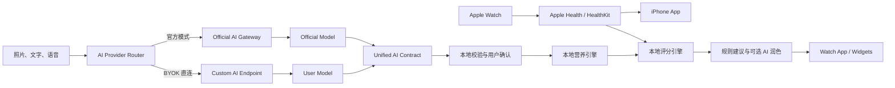

# HealthMonitorAI 完整设计方案

> 状态：Draft 0.1  
> 产品中文名：健康监控  
> GitHub：`Young-045/HealthMonitorAI`  
> 架构模式：方案 B，本地健康数据 + 官方 AI 网关 + 用户自定义 AI（BYOK）

## 1. 产品目标

HealthMonitorAI 面向 iPhone 与 Apple Watch 用户，自动读取经用户授权的活动、训练、睡眠与恢复数据，通过拍照、文字、语音或条码记录饮食，并生成可解释的健康评分、减脂建议和训练调整方案。

产品不是医疗诊断工具。AI 只负责识别、解释和语言组织；营养数字、能量计算和健康评分必须由可测试、可版本化的确定性算法完成。

### 1.1 MVP 闭环

1. Apple Watch 数据进入 Apple Health。
2. iPhone App 通过 HealthKit 增量读取授权数据。
3. 用户拍照或描述餐食。
4. AI 返回结构化食物候选、份量范围和不确定项。
5. 用户确认或修正。
6. 本地营养引擎计算营养并写回 Apple Health。
7. 本地评分引擎结合饮食、活动、睡眠和个人基线生成每日评分。
8. 规则引擎先形成安全建议，AI 只负责解释与润色。

## 2. 设计原则

- HealthKit 原始数据不上传服务端。
- 餐食、体重、评分和趋势默认只保存在设备。
- 官方服务端不形成集中式健康档案。
- BYOK API Key 只保存在本机 Keychain，不经过官方服务端。
- 官方 AI 和 BYOK 使用相同结构化契约及本地验证流程。
- 无网络、无 AI 或服务端停止运营时，手动记录、HealthKit 同步和基础评分仍可使用。
- 所有 AI 结果必须显示置信度、不确定项并允许修正。
- 不根据单次心率、HRV 或体重波动做医疗判断。

## 3. 系统上下文



## 4. 仓库结构

```text
HealthMonitorAI/
├── clients/
│   └── apple/
│       ├── README.md
│       └── Packages/HealthMonitorCore/
├── contracts/
│   └── ai/
├── docs/
│   ├── architecture-design.md
│   └── roadmap.md
├── src/
│   └── server/HealthMonitorAI.Api/
├── HealthMonitorAI.slnx
└── README.md
```

## 5. Apple 客户端

### 5.1 技术栈

- Swift 6、SwiftUI；
- HealthKit、WatchConnectivity、WidgetKit、App Intents；
- SwiftData 保存本地业务数据；
- Keychain 保存 API Key 和自定义鉴权头；
- URLSession 执行 HTTPS 请求；
- Vision 做图片质量检测、压缩和预处理；
- StoreKit 2 管理订阅。

最低目标版本建议为 iOS 17 和 watchOS 10。Windows 环境只维护 Swift Package、契约与源代码；最终 Xcode 工程、签名、HealthKit Entitlement 和真机验证必须在 macOS 完成。

### 5.2 HealthKit 读取范围

| 类别 | MVP | 后续 |
|---|---|---|
| 身体 | 身高、体重、体脂率 | 腰围等用户自定义数据 |
| 活动 | 步数、活动能量、静息能量、锻炼时间 | 站立趋势 |
| 训练 | 类型、时长、距离、能量、平均心率 | 心率区间与训练负荷 |
| 恢复 | 睡眠、静息心率、HRV | 呼吸频率、腕温、VO2 Max |

使用 HealthKit Observer Query 接收变化通知，使用 Anchored Query 增量读取并保存 Anchor。后台更新不是实时消息，界面必须显示最后同步时间。

### 5.3 写回 Apple Health

只写入用户确认后的膳食热量、蛋白质、脂肪、碳水、纤维、糖、钠和饮水。本 App 保存写入样本的 UUID；用户删除餐食时只删除本 App 创建的样本。

### 5.4 本地数据

```text
UserProfile
Meal / FoodItem
DailyHealthSummary
DailyScore
Recommendation
AIProviderProfile
HealthKitAnchor
```

API Key、自定义 Secret Header 与令牌不进入 SwiftData、iCloud、日志或导出文件。

## 6. AI 双通道

### 6.1 官方模式

```text
iPhone → HealthMonitorAI.Api → 官方模型供应商
```

服务端负责 App Attest、订阅和额度验证、模型路由、密钥保护、结构化响应校验、成本控制和故障切换。

### 6.2 BYOK 模式

```text
iPhone → 用户配置的 HTTPS AI 地址
```

- 用户密钥仅保存在 `ThisDeviceOnly` Keychain 项中；
- 首期支持 OpenAI Compatible Chat Completions；
- 后续支持 Responses、Anthropic Messages、Ollama；
- 更换域名或发生跨域重定向时重新确认；
- Authorization 不得跟随到不同主机；
- MVP 只允许 HTTPS，不全局关闭 ATS；
- 用户明确开启后，才允许发送聚合健康摘要；
- 切换失败时不得静默改用官方 AI。

### 6.3 AI 能力

```swift
protocol AIProvider {
    func analyzeMeal(_ request: MealAnalysisRequest) async throws -> MealAnalysisResult
    func generateCoaching(_ request: CoachingRequest) async throws -> CoachingResult
    func testConnection() async throws -> ConnectionTestResult
}
```

实现包括 `OfficialGatewayProvider`、`OpenAICompatibleProvider` 和 `LocalRuleProvider`。

## 7. 食物识别与营养计算

AI 输出菜名、候选食材、重量范围、烹饪方式、置信度和不确定项，不作为营养数字的最终来源。

```text
AI 识别结果
→ JSON Schema 校验
→ 本地食物库匹配
→ 用户确认重量、食用油、酱汁和做法
→ 标准每100克营养数据 × 确认重量
→ 营养汇总
```

中餐数据库优先覆盖米饭、面食、炒菜、盖饭、火锅、麻辣烫、汤、外卖和连锁餐厅。对食用油、糖、酱汁等照片不可见因素必须主动询问或标记不确定。

## 8. 健康评分

```text
每日健康分 =
25% 能量平衡
+ 25% 营养质量
+ 20% 活动完成
+ 20% 睡眠与恢复
+ 10% 习惯稳定性
```

评分必须同时返回：总分、五个子分、数据完整度、触发原因和算法版本。HRV、静息心率等采用最近 28 天个人中位数作为基线，不直接与人群固定阈值比较。

AI 不直接改变分数。规则引擎先生成原因代码，例如 `LOW_SLEEP_DURATION`、`HRV_BELOW_BASELINE`、`PROTEIN_TARGET_MISSED`，AI 再将原因转成自然语言。

## 9. 官方服务端

### 9.1 首批端点

| 方法 | 地址 | 作用 |
|---|---|---|
| GET | `/health` | 服务状态 |
| GET | `/v1/config` | 客户端能力与契约版本 |
| POST | `/v1/ai/meal-analysis` | 官方餐食识别 |
| POST | `/v1/ai/coaching` | 官方建议润色 |
| GET | `/v1/ai/usage` | 官方额度 |
| POST | `/v1/storekit/notifications` | StoreKit V2通知 |

所有端点使用 RFC 7807 Problem Details、CancellationToken、结构化日志和 OpenAPI。餐食识别在接入真实供应商前返回明确的 `503 AI_PROVIDER_NOT_CONFIGURED`，不能伪造识别结果。

### 9.2 服务端永久数据

仅保存 Account、DeviceAttestation、Entitlement、AIUsage、AIRequestAudit、ModelConfiguration 和 FoodCatalogVersion。

`AIRequestAudit` 只记录请求 ID、任务类型、模型、耗时、Token、图片字节数、状态和错误代码，不保存照片、正文、HealthKit 数据或完整模型响应。

### 9.3 临时数据

- 优先在内存中处理上传图片；
- 必须使用对象存储时采用私有 Bucket、随机对象名和不超过 15 分钟 TTL；
- 去除 EXIF 和位置元数据；
- 正常完成后立即删除；
- 错误样本只有用户单独同意才可短期保留。

## 10. API 安全

- 官方 API 使用 App Attest 防止伪造客户端消耗额度；
- 所有公网请求必须使用 TLS；
- 限制图片 MIME、像素、文件大小和请求频率；
- 系统提示词固定且版本化；
- 用户描述只作为数据，不得改变系统规则；
- 输出执行 JSON Schema 和业务范围校验；
- 日志中屏蔽 Authorization、API Key、图片及健康摘要；
- BYOK 模式在发送前展示目标域名和数据预览。

## 11. Watch App

Watch 端只承载短交互：今日评分、恢复状态、剩余蛋白质、饮水记录、常用餐食、语音记录和今日训练建议。拍照识别留在 iPhone。表盘复杂功能只展示摘要，不展示敏感明细。

## 12. 订阅

- 免费：HealthKit、手动记录、本地基础评分、BYOK、少量官方 AI 试用；
- 高级版：官方 AI 额度、完整恢复分析、周报、训练调整和高级 Watch 组件；
- BYOK 不消耗官方额度；
- 高级产品功能是否解锁仍由 StoreKit 权益决定；
- 服务端通过 App Store Server Notifications V2 维护权益状态。

## 13. 降级策略

| 故障 | 行为 |
|---|---|
| 官方 AI 不可用 | 手动录入或用户主动切换 BYOK |
| BYOK 401/403 | 明确提示密钥或权限错误 |
| BYOK 429 | 显示供应商额度限制 |
| 模型不支持图片 | 禁用该配置的拍照能力 |
| 返回非法 JSON | 不保存，允许重试或手动录入 |
| 无网络 | 使用本地历史、食物库、规则评分 |
| HealthKit部分拒绝 | 按可用数据评分并降低数据完整度 |

## 14. 验收标准

- HealthKit 增量同步无重复计入；
- API Key 不出现在数据库、日志、崩溃报告和导出文件；
- BYOK 请求不经过官方服务端；
- 跨域重定向不携带 Authorization；
- 食物识别输出必须通过契约和范围校验；
- 用户确认前不写入 Apple Health；
- 相同输入和相同算法版本得到相同评分；
- 每条建议可回溯到原因代码；
- 官方 AI 不可用时核心本地功能正常；
- 服务端构建无错误、无警告并能生成 OpenAPI。

## 15. 暂不纳入 MVP

- 医疗诊断和疾病治疗；
- 自动读取临床病历；
- 社交排行榜；
- 营养师远程诊疗；
- HealthKit 原始数据云端备份；
- 任意 HTTP AI 地址；
- 完全自动、不经用户确认的食物入账。
