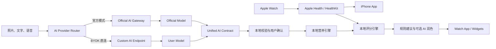
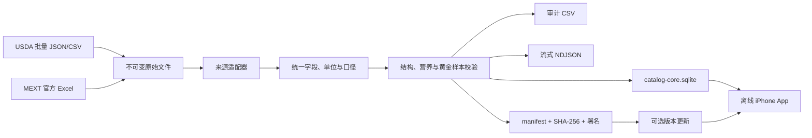

# HealthMonitorAI 完整设计方案

> 状态：Draft 0.1  
> 产品中文名：健康监控  
> GitHub：`Young-045/HealthMonitorAI`  
> 架构模式：方案 B，本地健康数据 + 官方 AI 网关 + 用户自定义 AI（BYOK）

## 1. 产品目标

HealthMonitorAI 面向 iPhone 与 Apple Watch 用户，自动读取经用户授权的活动、训练、睡眠与恢复数据，通过拍照、文字、语音或条码记录饮食，并生成可解释的健康评分、减脂建议和训练调整方案。

产品不是医疗诊断工具。AI 只负责识别、解释和语言组织；营养数字、能量计算和健康评分必须由可测试、可版本化的确定性算法完成。

### 1.1 MVP 闭环

1. Apple Watch 数据进入 Apple Health。
2. iPhone App 通过 HealthKit 增量读取授权数据。
3. 用户拍照或描述餐食。
4. AI 返回结构化食物候选、份量范围和不确定项。
5. 用户确认或修正。
6. 本地营养引擎计算营养并写回 Apple Health。
7. 本地评分引擎结合饮食、活动、睡眠和个人基线生成每日评分。
8. 规则引擎先形成安全建议，AI 只负责解释与润色。

## 2. 设计原则

- HealthKit 原始数据不上传服务端。
- 餐食、体重、评分和趋势默认只保存在设备。
- 官方服务端不形成集中式健康档案。
- BYOK API Key 只保存在本机 Keychain，不经过官方服务端。
- 官方 AI 和 BYOK 使用相同结构化契约及本地验证流程。
- 无网络、无 AI 或服务端停止运营时，手动记录、HealthKit 同步和基础评分仍可使用。
- 所有 AI 结果必须显示置信度、不确定项并允许修正。
- 不根据单次心率、HRV 或体重波动做医疗判断。

## 3. 系统上下文



## 4. 仓库结构

```text
HealthMonitorAI/
├── clients/
│   └── apple/
│       ├── README.md
│       └── Packages/HealthMonitorCore/
├── contracts/
│   └── ai/
├── docs/
│   ├── architecture-design.md
│   └── roadmap.md
├── src/
│   └── server/HealthMonitorAI.Api/
├── HealthMonitorAI.slnx
└── README.md
```

## 5. Apple 客户端

### 5.1 技术栈

- Swift 6、SwiftUI；
- HealthKit、WatchConnectivity、WidgetKit、App Intents；
- SwiftData 保存本地业务数据；
- Keychain 保存 API Key 和自定义鉴权头；
- URLSession 执行 HTTPS 请求；
- Vision 做图片质量检测、压缩和预处理；
- StoreKit 2 管理订阅。

最低目标版本建议为 iOS 17 和 watchOS 10。Windows 环境只维护 Swift Package、契约与源代码；最终 Xcode 工程、签名、HealthKit Entitlement 和真机验证必须在 macOS 完成。

### 5.2 HealthKit 读取范围

| 类别 | MVP | 后续 |
|---|---|---|
| 身体 | 身高、体重、体脂率 | 腰围等用户自定义数据 |
| 活动 | 步数、活动能量、静息能量、锻炼时间 | 站立趋势 |
| 训练 | 类型、时长、距离、能量、平均心率 | 心率区间与训练负荷 |
| 恢复 | 睡眠、静息心率、HRV | 呼吸频率、腕温、VO2 Max |

使用 HealthKit Observer Query 接收变化通知，使用 Anchored Query 增量读取并保存 Anchor。后台更新不是实时消息，界面必须显示最后同步时间。

### 5.3 写回 Apple Health

只写入用户确认后的膳食热量、蛋白质、脂肪、碳水、纤维、糖、钠和饮水。本 App 保存写入样本的 UUID；用户删除餐食时只删除本 App 创建的样本。

### 5.4 本地数据

```text
UserProfile
Meal / FoodItem
DailyHealthSummary
DailyScore
Recommendation
AIProviderProfile
HealthKitAnchor
```

API Key、自定义 Secret Header 与令牌不进入 SwiftData、iCloud、日志或导出文件。

### 5.5 权威食品成分离线目录

首期权威食品数据以日本文部科学省《日本食品标准成分表》和 USDA FoodData Central 为主，不在 App 运行时逐条请求外部营养 API。官方数据在构建或发布阶段下载、校验、标准化并生成版本化只读 SQLite；App 随包携带基础版本，在无网络、无 AI 或外部数据源不可用时仍可完成搜索、匹配和营养计算。

#### 5.5.1 首期数据源

| 来源 | 首期范围 | 主要用途 | 获取与发布策略 |
|---|---|---|---|
| USDA FoodData Central | 首版 Foundation Foods；后续加入 FNDDS、精选 SR Legacy | 基础食材、英语名称、常见复合食物与份量 | 使用官方批量 JSON/CSV；数据按 CC0 使用并保留建议署名 |
| 日本文部科学省 | 日本食品标准成分表 2020 年版（八订）及官方增补、订正 | 日本及亚洲常见食材、可食部与烹饪状态 | 使用官方 Excel；保存版本、原始食品编号、引用和使用规则 |

USDA Branded Foods 数据量大、更新频繁且主要来自商品标签，首期不进入 App 基础包。后续如需要条码商品，采用独立可选数据包或按地区精选，不让品牌库显著增加 IPA 和本地索引体积。

中国食物成分数据仍是后续重要方向，但只有在取得明确的批量使用和再分发许可后才接入正式发布管线；不得把网页抓取结果作为产品内置权威数据。

#### 5.5.2 数据分层与发布流



数据分为三层：

1. 原始层：保存官方下载文件、来源 URL、下载时间和 SHA-256，原始文件永不原地修改。
2. 标准化层：将各来源的食品、名称、营养素、份量、可食部和加工状态映射到统一模型；保留所有来源代码和推导信息。
3. 发布层：生成面向 App 的精简 SQLite，同时输出 CSV、NDJSON、许可及校验报告。CSV 和 NDJSON 用于审计、调试和再处理，不作为 App 主查询格式。

建议仓库结构：

```text
tools/food-data/
├── sources/
│   ├── usda.py
│   └── mext.py
├── mappings/
│   ├── nutrients.json
│   ├── categories.json
│   └── source-priority.json
├── validation/
├── fixtures/
└── cli.py

data/
├── manifests/       # 可提交的小型来源和版本清单
├── raw/             # 不提交大型原始文件
├── work/            # 不提交标准化中间文件
└── releases/        # CI Artifact 或对象存储
```

#### 5.5.3 统一数据模型

只读目录至少包含以下逻辑表：

```text
DatasetRelease
Food
FoodName
NutrientDefinition
FoodNutrient
FoodPortion
FoodCrossReference
```

`DatasetRelease` 保存来源、源版本、发布日期、来源 URL、许可、原始文件哈希和 ETL 管线版本。`Food` 使用内部稳定 ID，同时保存 `sourceCode + sourceFoodId`，不得假设 USDA FDC ID 与 MEXT 食品编号属于同一命名空间。

每条食品记录必须保留：

- 规范名称、来源描述、多语言名称和别名；
- 食品类别、生/熟/干制/泡发等状态及烹饪方式；
- `edible_100g`、`as_sold_100g`、`100ml` 或 `serving` 等数据口径；
- 可食部比例、默认份量和来源份量描述；
- 来源记录 ID、来源发布版本和数据质量级别。

首期规范营养键为：

```text
energy_kcal
protein_g
carbohydrate_g
fat_g
fiber_g
sugars_g
sodium_mg
```

同时保留来源营养素代码、原始单位、分析或推导方法。USDA Foundation Foods 可能同时提供不同 Atwater 方法的能量值，适配器必须执行显式、版本化的来源策略，不能仅凭名称取第一项，也不能覆盖原始值。

“没有数据”和“检测结果为零”必须分开表示。标准库使用缺少 `FoodNutrient` 行或显式可用性标记表示缺失，不允许在导入时把缺失的糖、纤维或钠写成 `0`。关键宏量营养素不完整的记录可参与搜索，但不得无提示地参与完整营养自动计算。

#### 5.5.4 来源冲突与选择规则

不同国家、品种、季节、检测方法和烹饪状态产生的差异是食品成分数据的一部分，不对 USDA 和 MEXT 同名记录直接求平均，也不删除来源记录。候选排序按以下信息综合决定：

1. 用户自建精确名称或别名；
2. 用户地区和界面语言；
3. 食品状态及烹饪方式精确匹配；
4. 规范名称优先于别名；
5. Foundation/MEXT 等分析数据优先于历史或标签推导数据；
6. 数据完整度和发布时间；
7. 稳定内部 ID，保证相同输入得到相同排序。

生米与熟米饭、生肉与烤肉、干豆与煮豆、带骨购买重量与可食部重量不得自动互相替代。存在多个合理候选时由用户确认。

#### 5.5.5 数据质量与可追溯性

每次发布必须自动执行：

- 主键、外键、来源 ID 和营养素映射完整性检查；
- NaN、Infinity、负数和非法单位拒绝；
- 克、毫克、千焦和千卡转换测试；
- 零值与缺失值区分测试；
- 可食部、每 100 克、每 100 毫升和每份口径检查；
- 食品数量、营养覆盖率和异常值相对上一版的漂移报告；
- 米饭、鸡蛋、鸡胸肉、牛奶、豆腐、苹果等固定黄金样本；
- SQLite `integrity_check`、索引和 schema 版本检查；
- 来源文件、发布文件 SHA-256、署名和许可清单检查。

能量与宏量营养素的估算差异只生成告警，不擅自覆盖权威来源值。所有修正规则必须进入版本控制并能从发布版本追溯。

发布版本采用 `数据日期 + 管线版本`，例如：

```text
catalogVersion: 2026.04+pipeline.1
schemaVersion: 1
sources:
  usda-foundation: 2026-04
  usda-fndds: 2021-2023
  usda-sr-legacy: 2018-04
  mext: 2020-8th-revision
```

#### 5.5.6 Apple 客户端存储与查询

权威目录与用户数据分离：

```text
AuthorityFoodCatalogStore   只读 SQLite，保存 USDA/MEXT
UserFoodCatalogStore        SwiftData，保存用户自建和用户覆盖
CompositeFoodCatalog        合并查询并执行确定性候选排序
MealFoodItem                SwiftData，保存用户确认时的营养快照
```

不得把数万条权威食品逐条写入 SwiftData，也不得通过 `@Query` 取出整个目录后线性扫描。SQLite 为名称、标准化名称、别名、来源 ID 和条码建立索引；中文、日文和英文检索使用预计算搜索键，必要时增加 CJK bigram 索引。

匹配顺序为：

```text
条码精确匹配
→ 规范名称精确匹配
→ 别名精确匹配
→ 多语言搜索键召回
→ 地区、状态、来源质量和完整度排序
→ 用户确认
```

只有高置信度精确匹配可以自动回填营养候选；模糊搜索只展示候选，不自动入账。AI 仍只提供食物名称、重量范围、烹饪方式和不确定项，不生成最终营养数字。

现有餐食营养快照继续保留，并补充：

```text
sourceCodeSnapshot
sourceFoodIdSnapshot
sourceReleaseSnapshot
nutrientAvailabilitySnapshot
basisSnapshot
foodStateSnapshot
```

目录更新不会重新计算或悄悄改变历史餐食。

#### 5.5.7 初始安装与更新

App Bundle 内置经过精简的 `catalog-core.sqlite`，保证首次启动和飞行模式可用。需要在线更新时，服务端只发布版本清单和静态数据包，不接收用户饮食或 HealthKit 数据：

```http
GET /v1/catalog/manifest
GET /catalog/releases/{version}/catalog-core.sqlite.zst
GET /catalog/releases/{version}/manifest.sig
```

客户端先下载到临时位置，再校验 SHA-256、签名、schema 兼容性和 SQLite `quick_check`，全部通过后原子切换当前版本，并保留上一个完整版本用于回滚。不得原地修改正在查询的数据库。首期可以只随 App Store 版本更新内置目录，远程更新接口在目录管线稳定后启用。

Apple Watch 不复制完整食品库，由 iPhone 完成搜索、匹配和计算，只同步用户收藏、最近餐食及确认后的营养快照。

#### 5.5.8 发布产物与验收标准

每个版本生成：

```text
food-catalog-{version}/
├── catalog-core.sqlite
├── foods.csv
├── food-nutrients.csv
├── catalog.ndjson
├── manifest.json
├── LICENSES.json
├── ATTRIBUTION.md
└── validation-report.json
```

首期验收标准：

- 飞行模式下可完成搜索、匹配、营养计算和餐食保存；
- 每个展示或计算值可追溯到来源、原始食品 ID 和发布版本；
- 缺失营养素不会被当成零；
- 更新目录不会改变历史餐食；
- 同一目录版本和相同查询得到确定性候选顺序；
- SQLite 完整性检查和黄金样本全部通过；
- 真机常用名称查询 P95 小于 50 毫秒；
- 基础数据包以 30–100 MB 为目标，超出时按数据类型或地区拆包；
- USDA、MEXT 的来源说明、许可或使用规则随发布产物保存；
- 数据下载或更新失败时继续使用上一个完整版本。

## 6. AI 双通道

### 6.1 官方模式

```text
iPhone → HealthMonitorAI.Api → 官方模型供应商
```

服务端负责 App Attest、订阅和额度验证、模型路由、密钥保护、结构化响应校验、成本控制和故障切换。

### 6.2 BYOK 模式

```text
iPhone → 用户配置的 HTTPS AI 地址
```

- 用户密钥仅保存在 `ThisDeviceOnly` Keychain 项中；
- 首期支持 OpenAI Compatible Chat Completions；
- 后续支持 Responses、Anthropic Messages、Ollama；
- 更换域名或发生跨域重定向时重新确认；
- Authorization 不得跟随到不同主机；
- MVP 只允许 HTTPS，不全局关闭 ATS；
- 用户明确开启后，才允许发送聚合健康摘要；
- 切换失败时不得静默改用官方 AI。

### 6.3 AI 能力

```swift
protocol AIProvider {
    func analyzeMeal(_ request: MealAnalysisRequest) async throws -> MealAnalysisResult
    func generateCoaching(_ request: CoachingRequest) async throws -> CoachingResult
    func testConnection() async throws -> ConnectionTestResult
}
```

实现包括 `OfficialGatewayProvider`、`OpenAICompatibleProvider` 和 `LocalRuleProvider`。

## 7. 食物识别与营养计算

AI 输出菜名、候选食材、重量范围、烹饪方式、置信度和不确定项，不作为营养数字的最终来源。

```text
AI 识别结果
→ JSON Schema 校验
→ 本地食物库匹配
→ 用户确认重量、食用油、酱汁和做法
→ 标准每100克营养数据 × 确认重量
→ 营养汇总
```

中餐数据库优先覆盖米饭、面食、炒菜、盖饭、火锅、麻辣烫、汤、外卖和连锁餐厅。对食用油、糖、酱汁等照片不可见因素必须主动询问或标记不确定。

## 8. 健康评分

```text
每日健康分 =
25% 能量平衡
+ 25% 营养质量
+ 20% 活动完成
+ 20% 睡眠与恢复
+ 10% 习惯稳定性
```

评分必须同时返回：总分、五个子分、数据完整度、触发原因和算法版本。HRV、静息心率等采用最近 28 天个人中位数作为基线，不直接与人群固定阈值比较。

AI 不直接改变分数。规则引擎先生成原因代码，例如 `LOW_SLEEP_DURATION`、`HRV_BELOW_BASELINE`、`PROTEIN_TARGET_MISSED`，AI 再将原因转成自然语言。

## 9. 官方服务端

### 9.1 首批端点

| 方法 | 地址 | 作用 |
|---|---|---|
| GET | `/health` | 服务状态 |
| GET | `/v1/config` | 客户端能力与契约版本 |
| POST | `/v1/ai/meal-analysis` | 官方餐食识别 |
| POST | `/v1/ai/coaching` | 官方建议润色 |
| GET | `/v1/ai/usage` | 官方额度 |
| POST | `/v1/storekit/notifications` | StoreKit V2通知 |

所有端点使用 RFC 7807 Problem Details、CancellationToken、结构化日志和 OpenAPI。餐食识别在接入真实供应商前返回明确的 `503 AI_PROVIDER_NOT_CONFIGURED`，不能伪造识别结果。

### 9.2 服务端永久数据

仅保存 Account、DeviceAttestation、Entitlement、AIUsage、AIRequestAudit、ModelConfiguration 和 FoodCatalogVersion。

`AIRequestAudit` 只记录请求 ID、任务类型、模型、耗时、Token、图片字节数、状态和错误代码，不保存照片、正文、HealthKit 数据或完整模型响应。

### 9.3 后台管理

服务端提供受 Cookie 登录和 `Admin` 角色保护的 `/admin` 页面，用于启停官方 AI、配置 OpenAI 兼容 HTTPS 地址、模型名称和服务端 API Key。后台密码通过部署环境变量或密钥服务注入，不进入配置文件。Provider API Key 使用 Data Protection 加密后保存在服务端私有卷，接口和页面均不回显明文；生产环境必须持久化并保护 Data Protection key ring。

该后台只控制官方服务端凭据。用户 BYOK 的地址和 API Key 仍由 App 保存在设备 Keychain，并直接连接用户指定的 AI Provider。

### 9.4 临时数据

- 优先在内存中处理上传图片；
- 必须使用对象存储时采用私有 Bucket、随机对象名和不超过 15 分钟 TTL；
- 去除 EXIF 和位置元数据；
- 正常完成后立即删除；
- 错误样本只有用户单独同意才可短期保留。

## 10. API 安全

- 官方 API 使用 App Attest 防止伪造客户端消耗额度；
- 所有公网请求必须使用 TLS；
- 限制图片 MIME、像素、文件大小和请求频率；
- 系统提示词固定且版本化；
- 用户描述只作为数据，不得改变系统规则；
- 输出执行 JSON Schema 和业务范围校验；
- 日志中屏蔽 Authorization、API Key、图片及健康摘要；
- BYOK 模式在发送前展示目标域名和数据预览。

## 11. Watch App

Watch 端只承载短交互：今日评分、恢复状态、剩余蛋白质、饮水记录、常用餐食、语音记录和今日训练建议。拍照识别留在 iPhone。表盘复杂功能只展示摘要，不展示敏感明细。

## 12. 订阅

- 免费：HealthKit、手动记录、本地基础评分、BYOK、少量官方 AI 试用；
- 高级版：官方 AI 额度、完整恢复分析、周报、训练调整和高级 Watch 组件；
- BYOK 不消耗官方额度；
- 高级产品功能是否解锁仍由 StoreKit 权益决定；
- 服务端通过 App Store Server Notifications V2 维护权益状态。

## 13. 降级策略

| 故障 | 行为 |
|---|---|
| 官方 AI 不可用 | 手动录入或用户主动切换 BYOK |
| BYOK 401/403 | 明确提示密钥或权限错误 |
| BYOK 429 | 显示供应商额度限制 |
| 模型不支持图片 | 禁用该配置的拍照能力 |
| 返回非法 JSON | 不保存，允许重试或手动录入 |
| 无网络 | 使用本地历史、食物库、规则评分 |
| HealthKit部分拒绝 | 按可用数据评分并降低数据完整度 |

## 14. 验收标准

- HealthKit 增量同步无重复计入；
- API Key 不出现在数据库、日志、崩溃报告和导出文件；
- BYOK 请求不经过官方服务端；
- 跨域重定向不携带 Authorization；
- 食物识别输出必须通过契约和范围校验；
- 用户确认前不写入 Apple Health；
- 相同输入和相同算法版本得到相同评分；
- 每条建议可回溯到原因代码；
- 官方 AI 不可用时核心本地功能正常；
- 服务端构建无错误、无警告并能生成 OpenAPI。

## 15. 暂不纳入 MVP

- 医疗诊断和疾病治疗；
- 自动读取临床病历；
- 社交排行榜；
- 营养师远程诊疗；
- HealthKit 原始数据云端备份；
- 任意 HTTP AI 地址；
- 完全自动、不经用户确认的食物入账。
